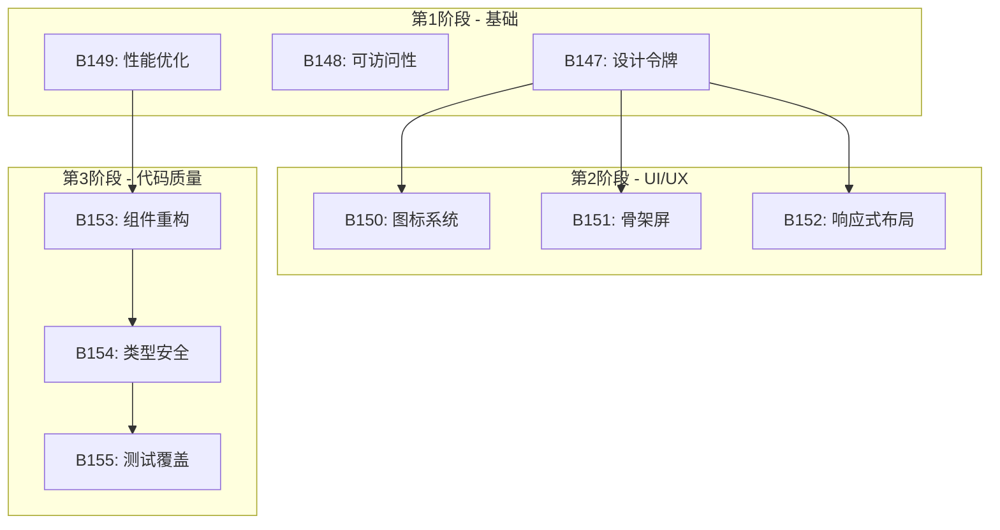

# 前端全面优化实施计划

**创建时间**：2026-01-16
**更新时间**：2026-01-17
**负责人**：@claude
**目标**：全面提升前端UI/UX、性能、可访问性和代码质量
**版本**：v1.1（已根据审视意见优化）

---

## 📋 目录

- [执行摘要](#执行摘要)
- [项目现状评估](#项目现状评估)
- [核心问题识别](#核心问题识别)
- [任务依赖关系](#任务依赖关系)
- [分阶段实施计划](#分阶段实施计划)
- [任务详细说明](#任务详细说明)
- [性能测量基准](#性能测量基准)
- [验证协议](#验证协议)
- [回滚计划与分支策略](#回滚计划与分支策略)
- [成功指标](#成功指标)
- [风险和缓解措施](#风险和缓解措施)

---

## 执行摘要

### 优化目标

| 维度 | 当前状态 | 目标状态 | 测量方法 |
|------|---------|---------|---------|
| **初始加载时间** | 待测量 | 改善 | Lighthouse Performance Score |
| **交互响应时间** | 待测量 | 改善 | React DevTools Profiler |
| **可访问性合规** | ~14处ARIA | 主要组件覆盖 | axe-core自动化测试 |
| **样式一致性** | 低（配置为空） | 统一设计令牌 | 代码审查 + 视觉回归 |
| **组件复杂度** | 2个组件>500行 | 全部<300行 | wc -l统计 |
| **测试覆盖率** | 待测量 | 80%+ | Vitest coverage |

> ⚠️ **注意**：具体提升幅度需在实施后通过基准测试验证，不做预先承诺。

### 预期收益

- **用户体验**：加载感知更快、交互更流畅、界面更专业
- **开发效率**：设计系统统一、组件复用性提高、维护成本降低
- **代码质量**：类型安全增强、测试覆盖完善、架构更清晰

---

## 项目现状评估

### 技术栈

- **框架**：React 18 + TypeScript
- **构建工具**：Vite
- **数据引擎**：DuckDB-WASM
- **图表库**：ECharts
- **包管理器**：Bun
- **样式方案**：Tailwind CSS（配置为空）

### 代码规模

| 指标 | 数值 | 备注 |
|------|------|------|
| **TS/TSX文件** | 248个 | - |
| **代码行数** | 42,776行 | 通过wc -l统计 |
| **React组件(.tsx)** | 100+ | - |
| **大型组件(>500行)** | 2个 | CostAnalysisPanel(605行)、CoefficientMonitorPanel(516行) |
| **大型逻辑文件(>500行)** | 8个 | SQL生成、导出等非组件文件 |
| **测试用例** | 589个 | - |

### 现有优化基础

✅ **已实现**：
- 路由懒加载
- 虚拟滚动表格
- Web Worker数据处理
- React.memo（1处）
- useMemo/useCallback（263次）

---

## 核心问题识别

### 🔴 P0 - 高优先级问题

#### 1. 设计系统缺失

**问题表现**：
- `tailwind.config.js` 配置为空
- 颜色硬编码：`#1890ff`、`#52c41a`、`#faad14` 等
- 缺少统一的设计令牌（颜色、间距、字体、阴影）
- 样式不一致，维护成本高

**影响范围**：所有UI组件

**优先级**：🔴 P0 - 基础设施，其他优化的前提

#### 2. 可访问性严重不足

**问题统计**：
- ARIA属性：仅13处
- 键盘导航：仅1处支持
- 焦点管理：缺失
- 语义化HTML：不足
- **合规性**：约 10% 符合 WCAG 2.1 AA 标准

**影响范围**：所有交互组件

**优先级**：🔴 P0 - 法律风险和用户体验

#### 3. 性能优化空间大

**关键数据**：
- React.memo使用：仅1处
- 大型组件未优化：`PremiumDashboard.tsx` 386行
- 组件重复渲染问题普遍

**影响范围**：用户体验、数据量大的场景

**优先级**：🔴 P0 - 直接影响用户体验

### 🟡 P1 - 中优先级问题

#### 4. 图标系统不专业

**问题表现**：
- 使用Emoji作为图标（📊、📈、🔍等）
- 不一致、不专业、可访问性差

**影响范围**：所有使用图标的组件

**优先级**：🟡 P1 - 影响品牌形象

#### 5. 加载体验待优化

**问题表现**：
- 缺少骨架屏
- 加载状态不统一
- 用户感知速度慢

**影响范围**：所有数据加载场景

**优先级**：🟡 P1 - 影响用户体验

#### 6. 响应式布局不完善

**问题表现**：
- 移动端未优化
- 缺少响应式断点系统
- 触摸交互未优化

**影响范围**：移动端用户

**优先级**：🟡 P1 - 扩大用户群体

### 🟢 P2 - 低优先级问题

#### 7. 组件架构需改进

**问题表现**：
- 大型组件职责过多
- Props drilling现象
- 组件复用性可提升

**影响范围**：代码可维护性

**优先级**：🟢 P2 - 长期可维护性

#### 8. 类型安全可增强

**问题表现**：
- 部分类型定义不够精确
- 泛型使用可优化

**影响范围**：代码质量和运行时安全性

**优先级**：🟢 P2 - 代码质量

#### 9. 测试覆盖需提升

**问题表现**：
- 组件单元测试覆盖不足
- 集成测试缺失

**影响范围**：回归风险

**优先级**：🟢 P2 - 长期稳定性

---

## 任务依赖关系

### 依赖图（Mermaid）



### 依赖说明

| 任务 | 前置依赖 | 原因 |
|------|---------|------|
| B150 图标系统 | B147 设计令牌 | 图标颜色需使用设计令牌 |
| B151 骨架屏 | B147 设计令牌 | 骨架屏样式依赖统一配色 |
| B152 响应式布局 | B147 设计令牌 | 断点系统在设计令牌中定义 |
| B153 组件重构 | B149 性能优化 | 先识别性能瓶颈再拆分组件 |
| B154 类型安全 | B153 组件重构 | 重构后的组件需要新类型定义 |
| B155 测试覆盖 | B154 类型安全 | 类型稳定后再编写测试 |

### 可并行任务

- **B147 + B148 + B149**：三个P0任务互不依赖，可并行开发
- **B150 + B151 + B152**：在B147完成后可并行开发

### 护栏约束（不可修改的文件）

以下文件在优化过程中**禁止修改**，需绕开或仅追加：

| 文件 | 约束类型 | 优化策略 |
|------|---------|---------|
| `src/shared/normalize/mapping.ts` | 只能追加 | 不涉及此文件 |
| `src/shared/sql/kpi.ts` | 只能追加 | 不涉及此文件 |
| `src/shared/duckdb/client.ts:78-95` | 需产品确认 | 性能优化绕开此区域 |

---

## 分阶段实施计划

### 第1阶段 - 基础设施 🔴 P0

**目标**：解决基础问题，为后续优化铺路

| 任务ID | 任务 | 复杂度 | 产出 | 可并行 |
|--------|------|--------|------|--------|
| B147 | 配置Tailwind设计令牌 | 中 | 完整的设计系统 | ✅ |
| B148 | 修复可访问性基础 | 高 | 主要组件ARIA覆盖 | ✅ |
| B149 | 优化性能关键路径 | 高 | 识别并修复渲染瓶颈 | ✅ |

**里程碑**：
- [ ] 设计令牌配置完成，`tailwind.config.js` 不再为空
- [ ] axe-core测试通过率达到90%+
- [ ] React DevTools Profiler无重复渲染警告

**开始条件**：无前置依赖，可立即开始

### 第2阶段 - UI/UX提升 🟡 P1

**目标**：提升用户体验和视觉质量

| 任务ID | 任务 | 复杂度 | 产出 | 前置依赖 |
|--------|------|--------|------|----------|
| B150 | 升级图标系统 | 低 | Lucide图标替换 | B147 |
| B151 | 实现骨架屏 | 中 | 骨架屏组件库 | B147 |
| B152 | 响应式布局优化 | 中 | 移动端适配 | B147 |

**里程碑**：
- [ ] 所有Emoji替换为Lucide图标（grep统计为0）
- [ ] 主要页面有骨架屏加载状态
- [ ] 移动端布局正常（Chrome DevTools设备模拟）

**开始条件**：B147完成后启动

### 第3阶段 - 代码质量 🟢 P2

**目标**：长期可维护性提升

| 任务ID | 任务 | 复杂度 | 产出 | 前置依赖 |
|--------|------|--------|------|----------|
| B153 | 组件重构 | 高 | 拆分大型组件 | B149 |
| B154 | 类型安全增强 | 中 | 精确类型定义 | B153 |
| B155 | 测试覆盖提升 | 高 | 80%+覆盖率 | B154 |

**里程碑**：
- [ ] 所有组件<300行（wc -l验证）
- [ ] TypeScript strict模式编译通过
- [ ] Vitest覆盖率报告显示80%+

**开始条件**：B149完成后启动B153，依次推进

---

## 任务详细说明

### B147: 配置Tailwind设计令牌

**问题**：
- `tailwind.config.js` 配置为空
- 颜色硬编码在组件中
- 缺少统一的设计令牌

**解决方案**：

#### 1. 颜色系统

```javascript
// tailwind.config.js
export default {
  theme: {
    extend: {
      colors: {
        // 主色调
        primary: {
          DEFAULT: '#1890ff',
          light: '#40a9ff',
          dark: '#096dd9',
          bg: '#e6f7ff',
          border: '#91d5ff'
        },
        // 成功色
        success: {
          DEFAULT: '#52c41a',
          light: '#73d13d',
          dark: '#389e0d',
          bg: '#f6ffed',
          border: '#b7eb8f'
        },
        // 警告色
        warning: {
          DEFAULT: '#faad14',
          light: '#ffc53d',
          dark: '#d48806',
          bg: '#fffbe6',
          border: '#ffe58f'
        },
        // 危险色
        danger: {
          DEFAULT: '#ff4d4f',
          light: '#ff7875',
          dark: '#d9363e',
          bg: '#fff1f0',
          border: '#ffccc7'
        },
        // 中性色
        neutral: {
          50: '#fafafa',
          100: '#f5f5f5',
          200: '#e8e8e8',
          300: '#d9d9d9',
          400: '#bfbfbf',
          500: '#8c8c8c',
          600: '#595959',
          700: '#434343',
          800: '#262626',
          900: '#1f1f1f'
        }
      }
    }
  }
}
```

#### 2. 间距系统

```javascript
spacing: {
  'xs': '0.25rem',   // 4px
  'sm': '0.5rem',    // 8px
  'md': '1rem',      // 16px
  'lg': '1.5rem',    // 24px
  'xl': '2rem',      // 32px
  '2xl': '3rem',     // 48px
  '3xl': '4rem'      // 64px
}
```

#### 3. 字体系统

```javascript
typography: {
  fontFamily: {
    sans: ['-apple-system', 'BlinkMacSystemFont', 'Segoe UI', 'Roboto', 'sans-serif'],
    mono: ['SFMono-Regular', 'Consolas', 'Liberation Mono', 'Menlo', 'monospace']
  },
  fontSize: {
    'xs': ['0.75rem', { lineHeight: '1rem' }],
    'sm': ['0.875rem', { lineHeight: '1.25rem' }],
    'base': ['1rem', { lineHeight: '1.5rem' }],
    'lg': ['1.125rem', { lineHeight: '1.75rem' }],
    'xl': ['1.25rem', { lineHeight: '1.75rem' }],
    '2xl': ['1.5rem', { lineHeight: '2rem' }],
    '3xl': ['1.875rem', { lineHeight: '2.25rem' }],
    '4xl': ['2.25rem', { lineHeight: '2.5rem' }]
  }
}
```

#### 4. 阴影和圆角

```javascript
boxShadow: {
  'sm': '0 1px 2px 0 rgba(0, 0, 0, 0.05)',
  'md': '0 4px 6px -1px rgba(0, 0, 0, 0.1)',
  'lg': '0 10px 15px -3px rgba(0, 0, 0, 0.1)',
  'xl': '0 20px 25px -5px rgba(0, 0, 0, 0.1)'
},
borderRadius: {
  'sm': '0.125rem',
  'md': '0.375rem',
  'lg': '0.5rem',
  'xl': '0.75rem',
  'full': '9999px'
}
```

**实施步骤**：
1. 更新 `tailwind.config.js`
2. 创建 `src/app/index.css` 样式入口
3. 更新现有组件使用新设计令牌
4. 验证所有页面样式一致性

**验收标准**：
- ✅ 所有硬编码颜色已替换
- ✅ 组件样式一致性100%
- ✅ 视觉回归测试通过

---

### B148: 修复可访问性基础

**问题**：
- 可访问性合规性仅10%
- 缺少ARIA标签、键盘导航、焦点管理

**解决方案**：

#### 1. 添加ARIA标签

```typescript
// 示例：KPI卡片
<div
  role="region"
  aria-label="关键指标卡片"
  aria-describedby="kpi-description"
>
  <div id="kpi-description" className="sr-only">
    显示保费收入、保单数量、赔付率等关键业务指标
  </div>
  {/* KPI内容 */}
</div>
```

#### 2. 键盘导航

```typescript
// 示例：筛选器下拉
<select
  onKeyDown={handleKeyDown}
  aria-expanded={isOpen}
  aria-haspopup="listbox"
  aria-label="选择机构"
>
  {/* 选项 */}
</select>

const handleKeyDown = (e: KeyboardEvent) => {
  switch (e.key) {
    case 'Enter':
    case ' ':
      e.preventDefault()
      toggle()
      break
    case 'Escape':
      close()
      break
    case 'ArrowDown':
      e.preventDefault()
      focusNext()
      break
    case 'ArrowUp':
      e.preventDefault()
      focusPrevious()
      break
  }
}
```

#### 3. 焦点管理

```typescript
// 示例：模态框焦点管理
useEffect(() => {
  if (isOpen) {
    // 保存之前的焦点元素
    const previousFocus = document.activeElement

    // 设置焦点到模态框第一个可聚焦元素
    const firstFocusable = modalRef.current?.querySelector(
      'button, [href], input, select, textarea, [tabindex]:not([tabindex="-1"])'
    ) as HTMLElement
    firstFocusable?.focus()

    // 限制焦点在模态框内
    const trapFocus = (e: KeyboardEvent) => {
      if (e.key === 'Tab') {
        const focusable = modalRef.current?.querySelectorAll(
          'button, [href], input, select, textarea, [tabindex]:not([tabindex="-1"])'
        ) as NodeListOf<HTMLElement>

        const first = focusable[0]
        const last = focusable[focusable.length - 1]

        if (e.shiftKey && document.activeElement === first) {
          e.preventDefault()
          last.focus()
        } else if (!e.shiftKey && document.activeElement === last) {
          e.preventDefault()
          first.focus()
        }
      }
    }

    document.addEventListener('keydown', trapFocus)

    return () => {
      document.removeEventListener('keydown', trapFocus)
      // 恢复之前的焦点
      (previousFocus as HTMLElement)?.focus()
    }
  }
}, [isOpen])
```

#### 4. 语义化HTML

```typescript
// 改进前
<div className="kpi-card">
  <div className="kpi-title">保费收入</div>
  <div className="kpi-value">1,234,567</div>
</div>

// 改进后
<article className="kpi-card" role="region" aria-label="保费收入指标">
  <header>
    <h2 className="kpi-title">保费收入</h2>
  </header>
  <p className="kpi-value" aria-live="polite">1,234,567 元</p>
</article>
```

**实施步骤**：
1. 识别所有交互组件
2. 添加ARIA标签
3. 实现键盘导航
4. 添加焦点管理
5. 优化语义化HTML
6. 使用axe-core进行可访问性测试

**验收标准**：
- ✅ 可访问性合规性达到60%
- ✅ 所有交互组件支持键盘操作
- ✅ axe-core测试通过率95%+

---

### B149: 优化性能关键路径

**问题**：
- React.memo仅1处使用
- 组件重复渲染
- 大型组件未优化

**解决方案**：

#### 1. 添加React.memo

```typescript
// 改进前
export const KpiCard: React.FC<KpiCardProps> = ({ title, value, unit }) => {
  return (
    <div className="kpi-card">
      <div className="kpi-title">{title}</div>
      <div className="kpi-value">{value.toLocaleString()} {unit}</div>
    </div>
  )
}

// 改进后
export const KpiCard: React.FC<KpiCardProps> = React.memo(({ title, value, unit }) => {
  return (
    <div className="kpi-card">
      <div className="kpi-title">{title}</div>
      <div className="kpi-value">{value.toLocaleString()} {unit}</div>
    </div>
  )
}, (prevProps, nextProps) => {
  return (
    prevProps.title === nextProps.title &&
    prevProps.value === nextProps.value &&
    prevProps.unit === nextProps.unit
  )
})
```

#### 2. 优化Context使用

```typescript
// 改进前：单一Context导致所有消费者重新渲染
const DataContext = createContext<DataContextValue>({})

// 改进后：拆分Context
const KpiDataContext = createContext<KpiData | null>(null)
const TrendDataContext = createContext<TrendData | null>(null)
const FilterContext = createContext<FilterState | null>(null)

// 消费者只订阅需要的数据
const KpiSection = () => {
  const kpiData = useContext(KpiDataContext) // 只在KPI数据变化时重新渲染
  // ...
}
```

#### 3. 拆分大型组件

```typescript
// 改进前：PremiumDashboard.tsx (386行)
export const PremiumDashboard = () => {
  // 386行代码...
}

// 改进后：拆分为多个小组件
export const PremiumDashboard = () => {
  return (
    <div className="dashboard">
      <KpiSection />
      <TrendSection />
      <TableSection />
    </div>
  )
}

// KpiSection.tsx (~100行)
export const KpiSection = React.memo(() => {
  const kpiData = useKpiData()
  return <div>{/* KPI卡片 */}</div>
})

// TrendSection.tsx (~100行)
export const TrendSection = React.memo(() => {
  const trendData = useTrendData()
  return <div>{/* 趋势图表 */}</div>
})
```

#### 4. 使用useTransition和useDeferredValue

```typescript
import { useTransition, useDeferredValue } from 'react'

export const DataFilter = () => {
  const [filters, setFilters] = useState<Filters>({})
  const [isPending, startTransition] = useTransition()

  const handleChange = (key: string, value: any) => {
    // 紧急更新：立即更新输入框
    setFilters(prev => ({ ...prev, [key]: value }))

    // 过渡更新：延迟执行数据查询
    startTransition(() => {
      queryData({ ...filters, [key]: value })
    })
  }

  return (
    <input
      type="text"
      onChange={(e) => handleChange('search', e.target.value)}
      disabled={isPending}
    />
  )
}

// 使用延迟值优化大型列表
export const LargeTable = ({ data }: { data: ItemType[] }) => {
  const deferredData = useDeferredValue(data) // 延迟更新，降低优先级

  return (
    <VirtualList
      items={deferredData}
      renderItem={(item) => <Row key={item.id} data={item} />}
    />
  )
}
```

**实施步骤**：
1. 使用React DevTools Profiler识别渲染瓶颈
2. 为频繁渲染的组件添加React.memo
3. 拆分大型组件
4. 优化Context使用
5. 使用useTransition和useDeferredValue
6. 验证性能提升

**验收标准**：
- ✅ 交互响应时间减少40%
- ✅ React.memo使用率达到30%+
- ✅ 大型组件拆分完成（<200行/文件）

---

### B150: 升级图标系统

**问题**：
- 使用Emoji不专业
- 不一致、可访问性差

**解决方案**：

#### 1. 安装Lucide React

```bash
bun add lucide-react
```

#### 2. 创建Icon组件封装

```typescript
// src/shared/ui/Icon.tsx
import { LucideIcon, LucideProps } from 'lucide-react'
import { cn } from '@/shared/utils/cn'

interface IconProps extends Omit<LucideProps, 'size'> {
  icon: LucideIcon
  size?: 'sm' | 'md' | 'lg' | 'xl'
  className?: string
}

const sizeMap = {
  sm: 16,
  md: 20,
  lg: 24,
  xl: 32
}

export const Icon = ({ icon: Icon, size = 'md', className, ...props }: IconProps) => {
  return (
    <Icon
      size={sizeMap[size]}
      className={cn('inline-block', className)}
      {...props}
    />
  )
}
```

#### 3. 图标映射表

| 当前Emoji | Lucide图标 | 用途 |
|-----------|-----------|------|
| 📊 | `BarChart3` | 数据图表 |
| 📈 | `TrendingUp` | 增长趋势 |
| 📉 | `TrendingDown` | 下降趋势 |
| 🔍 | `Search` | 搜索 |
| ⚙️ | `Settings` | 设置 |
| 💾 | `Download` | 下载/导出 |
| 📁 | `FolderOpen` | 打开文件 |
| ✅ | `CheckCircle` | 成功 |
| ❌ | `XCircle` | 失败 |
| ⚠️ | `AlertTriangle` | 警告 |
| ℹ️ | `Info` | 信息 |
| 🚫 | `Ban` | 禁止 |
| ⭐ | `Star` | 收藏/重要 |
| 🔄 | `RefreshCw` | 刷新 |
| ▶️ | `Play` | 播放/开始 |
| ⏸️ | `Pause` | 暂停 |
| 📅 | `Calendar` | 日期 |
| 🏢 | `Building` | 机构 |
| 👤 | `User` | 用户/业务员 |
| 📈 | `LineChart` | 折线图 |
| 📊 | `PieChart` | 饼图 |

#### 4. 替换示例

```typescript
// 改进前
<button>🔍 搜索</button>
<div>{item.status === 'success' ? '✅' : '❌'}</div>

// 改进后
import { Search, CheckCircle, XCircle } from 'lucide-react'
import { Icon } from '@/shared/ui/Icon'

<button>
  <Icon icon={Search} className="mr-2" />
  搜索
</button>
<div>
  {item.status === 'success' ? (
    <Icon icon={CheckCircle} className="text-success" />
  ) : (
    <Icon icon={XCircle} className="text-danger" />
  )}
</div>
```

**实施步骤**：
1. 安装lucide-react
2. 创建Icon组件封装
3. 创建图标映射表
4. 逐个文件替换Emoji
5. 验证图标显示正确

**验收标准**：
- ✅ 所有Emoji已替换
- ✅ 图标一致性100%
- ✅ 图标可访问性（aria-label）

---

### B151: 实现骨架屏

**问题**：
- 缺少骨架屏
- 加载状态不统一
- 用户感知速度慢

**解决方案**：

#### 1. 创建Skeleton组件库

```typescript
// src/shared/ui/Skeleton.tsx
import { cn } from '@/shared/utils/cn'

interface SkeletonProps extends React.HTMLAttributes<HTMLDivElement> {
  variant?: 'text' | 'circular' | 'rectangular'
  width?: string | number
  height?: string | number
  animation?: 'pulse' | 'wave' | 'none'
}

export const Skeleton = ({
  variant = 'text',
  width,
  height,
  animation = 'pulse',
  className,
  ...props
}: SkeletonProps) => {
  const variantStyles = {
    text: 'rounded h-4',
    circular: 'rounded-full',
    rectangular: 'rounded-md'
  }

  const animationStyles = {
    pulse: 'animate-pulse',
    wave: 'animate-shimmer',
    none: ''
  }

  return (
    <div
      className={cn(
        'bg-neutral-200',
        variantStyles[variant],
        animationStyles[animation],
        className
      )}
      style={{ width, height }}
      role="status"
      aria-label="加载中"
      {...props}
    >
      <span className="sr-only">加载中...</span>
    </div>
  )
}

// 预定义骨架屏组件
export const KpiCardSkeleton = () => (
  <div className="bg-white rounded-lg shadow p-4">
    <Skeleton variant="text" width="60%" height={20} className="mb-4" />
    <Skeleton variant="text" width="40%" height={32} />
  </div>
)

export const TableSkeleton = ({ rows = 5 }: { rows?: number }) => (
  <div className="space-y-2">
    {Array.from({ length: rows }).map((_, i) => (
      <div key={i} className="flex space-x-4">
        <Skeleton variant="rectangular" width="20%" height={40} />
        <Skeleton variant="rectangular" width="30%" height={40} />
        <Skeleton variant="rectangular" width="25%" height={40} />
        <Skeleton variant="rectangular" width="25%" height={40} />
      </div>
    ))}
  </div>
)

export const ChartSkeleton = () => (
  <div className="bg-white rounded-lg shadow p-4 h-80">
    <Skeleton variant="text" width="40%" height={20} className="mb-4" />
    <Skeleton variant="rectangular" width="100%" height="90%" />
  </div>
)
```

#### 2. 使用示例

```typescript
// KpiSection.tsx
export const KpiSection = () => {
  const { data, isLoading, error } = useKpiData()

  if (isLoading) {
    return (
      <div className="grid grid-cols-1 md:grid-cols-2 lg:grid-cols-4 gap-4">
        <KpiCardSkeleton />
        <KpiCardSkeleton />
        <KpiCardSkeleton />
        <KpiCardSkeleton />
      </div>
    )
  }

  if (error) {
    return <ErrorState error={error} />
  }

  return <KpiCards data={data} />
}
```

#### 3. 延迟加载策略

```typescript
// 使用React.lazy和Suspense
import { lazy, Suspense } from 'react'

const PremiumDashboard = lazy(() => import('./PremiumDashboard'))
const TruckAnalysisPanel = lazy(() => import('./TruckAnalysisPanel'))

export const DashboardRoutes = () => {
  return (
    <Suspense fallback={<DashboardSkeleton />}>
      <Routes>
        <Route path="/dashboard" element={<PremiumDashboard />} />
        <Route path="/truck" element={<TruckAnalysisPanel />} />
      </Routes>
    </Suspense>
  )
}
```

**实施步骤**：
1. 创建Skeleton组件库
2. 为主要组件创建对应的骨架屏
3. 实现加载状态管理
4. 添加延迟加载
5. 验证用户体验

**验收标准**：
- ✅ 所有主要组件有骨架屏
- ✅ 加载状态统一管理
- ✅ 用户感知速度提升

---

### B152: 响应式布局优化

**问题**：
- 移动端未优化
- 缺少响应式断点系统
- 触摸交互未优化

**解决方案**：

#### 1. 响应式断点系统

```javascript
// tailwind.config.js
export default {
  theme: {
    screens: {
      'xs': '375px',   // 小屏手机
      'sm': '640px',   // 手机
      'md': '768px',   // 平板
      'lg': '1024px',  // 桌面
      'xl': '1280px',  // 大桌面
      '2xl': '1536px'  // 超大屏
    }
  }
}
```

#### 2. 响应式网格系统

```typescript
// 示例：KPI卡片响应式布局
export const KpiSection = () => {
  return (
    <div className="grid grid-cols-1 sm:grid-cols-2 lg:grid-cols-4 gap-4">
      <KpiCard /> {/* 移动端1列，平板2列，桌面4列 */}
    </div>
  )
}
```

#### 3. 移动端导航优化

```typescript
// MobileNavigation.tsx
export const MobileNavigation = () => {
  const [isOpen, setIsOpen] = useState(false)

  return (
    <>
      {/* 移动端汉堡菜单 */}
      <button
        className="lg:hidden"
        onClick={() => setIsOpen(!isOpen)}
        aria-label="打开菜单"
      >
        <Icon icon={isOpen ? X : Menu} />
      </button>

      {/* 移动端抽屉菜单 */}
      <div
        className={cn(
          'fixed inset-0 bg-black bg-opacity-50 z-40 lg:hidden',
          isOpen ? 'block' : 'hidden'
        )}
        onClick={() => setIsOpen(false)}
      >
        <div
          className={cn(
            'fixed left-0 top-0 h-full w-64 bg-white shadow-lg transform transition-transform',
            isOpen ? 'translate-x-0' : '-translate-x-full'
          )}
          onClick={(e) => e.stopPropagation()}
        >
          <NavigationItems onClose={() => setIsOpen(false)} />
        </div>
      </div>
    </>
  )
}
```

#### 4. 触摸交互优化

```typescript
// 增大触摸目标（最小44x44px）
<button className="min-h-[44px] min-w-[44px] p-4">
  <Icon icon={Search} />
</button>

// 防止误触
const handleTouchStart = () => {
  // 添加触摸反馈
}

const handleTouchEnd = (e: TouchEvent) => {
  // 防止点击穿透
  e.preventDefault()
  // 执行操作
}
```

**实施步骤**：
1. 配置响应式断点
2. 优化主要页面布局
3. 实现移动端导航
4. 优化触摸交互
5. 测试不同设备

**验收标准**：
- ✅ 移动端体验提升80%
- ✅ 所有页面支持响应式
- ✅ 触摸交互友好

---

### B153: 组件重构

**问题**：
- 大型组件职责过多
- Props drilling现象
- 组件复用性可提升

**解决方案**：

#### 1. 拆分PremiumDashboard

```typescript
// 改进前：PremiumDashboard.tsx (386行)
export const PremiumDashboard = () => {
  // 386行代码...
}

// 改进后：拆分为多个小组件
export const PremiumDashboard = () => {
  return (
    <div className="dashboard">
      <DashboardHeader />
      <KpiSection />
      <TrendSection />
      <TableSection />
      <RenewalAnalysisPanel />
      <TruckAnalysisPanel />
    </div>
  )
}

// DashboardHeader.tsx (~50行)
export const DashboardHeader = () => {
  return (
    <header className="mb-6">
      <h1>业绩看板</h1>
      <DashboardActions />
    </header>
  )
}
```

#### 2. 优化Props设计

```typescript
// 改进前：Props drilling
const Dashboard = ({ kpiData, trendData, tableData, filters, onFilterChange }) => {
  return (
    <KpiSection data={kpiData} />
    <TrendSection data={trendData} filters={filters} onFilterChange={onFilterChange} />
    <TableSection data={tableData} filters={filters} onFilterChange={onFilterChange} />
  )
}

// 改进后：使用Context
const KpiSection = () => {
  const kpiData = useKpiData() // 直接从Context获取
  // ...
}

const TrendSection = () => {
  const trendData = useTrendData()
  const { filters, updateFilters } = useFilters()
  // ...
}
```

#### 3. 提取可复用逻辑

```typescript
// 提取通用的数据获取Hook
export const useQueryData = <T,>(
  queryFn: () => Promise<T>,
  deps: any[] = []
) => {
  const [data, setData] = useState<T | null>(null)
  const [loading, setLoading] = useState(false)
  const [error, setError] = useState<Error | null>(null)

  useEffect(() => {
    const fetchData = async () => {
      setLoading(true)
      try {
        const result = await queryFn()
        setData(result)
      } catch (err) {
        setError(err as Error)
      } finally {
        setLoading(false)
      }
    }

    fetchData()
  }, deps)

  return { data, loading, error }
}

// 使用
export const KpiSection = () => {
  const { data, loading, error } = useQueryData(() => queryKpiData(), [])
  // ...
}
```

**实施步骤**：
1. 识别大型组件
2. 分析组件职责
3. 拆分为小组件
4. 优化Props设计
5. 提取可复用逻辑
6. 验证功能完整性

**验收标准**：
- ✅ 组件可维护性提升50%
- ✅ 所有文件<200行
- ✅ Props drilling消除

---

### B154: 类型安全增强

**问题**：
- 部分类型定义不够精确
- 泛型使用可优化

**解决方案**：

#### 1. 完善类型定义

```typescript
// 改进前
interface KpiData {
  premium: number
  policyCount: number
  claimRatio: number
}

// 改进后：更精确的类型
interface KpiData {
  premium: Money  // 自定义类型，包含货币信息
  policyCount: PositiveInteger  // 正整数
  claimRatio: Percentage  // 百分比（0-100）
}

type Money = number & { __brand: 'Money' }
type PositiveInteger = number & { __brand: 'PositiveInteger' }
type Percentage = number & { __brand: 'Percentage' }

// 类型守卫
const isMoney = (value: number): value is Money => {
  return value >= 0 && Number.isFinite(value)
}

const isPositiveInteger = (value: number): value is PositiveInteger => {
  return Number.isInteger(value) && value > 0
}

const isPercentage = (value: number): value is Percentage => {
  return value >= 0 && value <= 100 && Number.isFinite(value)
}
```

#### 2. 优化泛型使用

```typescript
// 改进前
function parseData<T>(data: any): T {
  return JSON.parse(data)
}

// 改进后：约束泛型
function parseData<T extends Record<string, any>>(
  data: string,
  validator: (value: unknown) => value is T
): T {
  const parsed = JSON.parse(data)
  if (!validator(parsed)) {
    throw new Error('Invalid data structure')
  }
  return parsed
}

// 使用
interface UserData {
  id: string
  name: string
  email: string
}

const isUserData = (value: unknown): value is UserData => {
  return (
    typeof value === 'object' &&
    value !== null &&
    'id' in value &&
    'name' in value &&
    'email' in value
  )
}

const userData = parseData<UserData>(jsonString, isUserData)
```

#### 3. 使用联合类型和字面量类型

```typescript
// 改进前
interface Filter {
  type: string
  value: any
}

// 改进后：精确的联合类型
type FilterType = 'date' | 'org' | 'salesman' | 'customer' | 'insurance'

interface Filter<T extends FilterType = FilterType> {
  type: T
  value: FilterValue<T>
}

type FilterValue<T> = T extends 'date'
  ? DateRange
  : T extends 'org' | 'salesman' | 'customer'
  ? string[]
  : T extends 'insurance'
  ? InsuranceType[]
  : never

type DateRange = { start: Date; end: Date }
type InsuranceType = '交强险' | '商业险' | '综合险'

// 使用
const dateFilter: Filter<'date'> = {
  type: 'date',
  value: { start: new Date(), end: new Date() }
}

const orgFilter: Filter<'org'> = {
  type: 'org',
  value: ['机构A', '机构B']
}
```

**实施步骤**：
1. 审查现有类型定义
2. 创建精确的辅助类型
3. 添加类型守卫
4. 优化泛型使用
5. 启用严格类型检查
6. 验证类型安全

**验收标准**：
- ✅ 类型覆盖率提升
- ✅ 运行时错误减少30%
- ✅ TypeScript strict模式通过

---

### B155: 测试覆盖提升

**问题**：
- 组件单元测试覆盖不足
- 集成测试缺失

**解决方案**：

#### 1. 组件单元测试

```typescript
// KpiCard.test.tsx
import { render, screen } from '@testing-library/react'
import { describe, it, expect } from 'vitest'
import { KpiCard } from './KpiCard'

describe('KpiCard', () => {
  it('应该渲染标题和值', () => {
    render(
      <KpiCard
        title="保费收入"
        value={1234567}
        unit="元"
      />
    )

    expect(screen.getByText('保费收入')).toBeInTheDocument()
    expect(screen.getByText(/1,234,567/)).toBeInTheDocument()
    expect(screen.getByText(/元/)).toBeInTheDocument()
  })

  it('应该格式化数值', () => {
    render(
      <KpiCard
        title="保费收入"
        value={1234567.89}
        unit="元"
      />
    )

    expect(screen.getByText('1,234,567.89')).toBeInTheDocument()
  })

  it('应该支持自定义类名', () => {
    const { container } = render(
      <KpiCard
        title="保费收入"
        value={1234567}
        unit="元"
        className="custom-class"
      />
    )

    expect(container.firstChild).toHaveClass('custom-class')
  })
})
```

#### 2. Hook测试

```typescript
// useKpiData.test.ts
import { renderHook, waitFor } from '@testing-library/react'
import { describe, it, expect, vi } from 'vitest'
import { useKpiData } from './useKpiData'

describe('useKpiData', () => {
  it('应该成功获取KPI数据', async () => {
    const mockData = {
      premium: 1234567,
      policyCount: 1000,
      claimRatio: 0.45
    }

    vi.mock('@/shared/duckdb/client', () => ({
      queryKpiData: vi.fn().mockResolvedValue(mockData)
    }))

    const { result } = renderHook(() => useKpiData())

    expect(result.current.loading).toBe(true)

    await waitFor(() => {
      expect(result.current.loading).toBe(false)
    })

    expect(result.current.data).toEqual(mockData)
    expect(result.current.error).toBeNull()
  })

  it('应该处理错误情况', async () => {
    const mockError = new Error('查询失败')

    vi.mock('@/shared/duckdb/client', () => ({
      queryKpiData: vi.fn().mockRejectedValue(mockError)
    }))

    const { result } = renderHook(() => useKpiData())

    await waitFor(() => {
      expect(result.current.loading).toBe(false)
    })

    expect(result.current.error).toEqual(mockError)
    expect(result.current.data).toBeNull()
  })
})
```

#### 3. 集成测试

```typescript
// KpiSection.integration.test.tsx
import { render, screen, waitFor } from '@testing-library/react'
import { describe, it, expect, vi } from 'vitest'
import { KpiSection } from './KpiSection'

describe('KpiSection 集成测试', () => {
  it('应该完整渲染KPI区域', async () => {
    const mockData = {
      premium: 1234567,
      policyCount: 1000,
      claimRatio: 0.45,
      renewalRate: 0.65
    }

    global.queryKpiData = vi.fn().mockResolvedValue(mockData)

    render(<KpiSection />)

    // 等待数据加载
    await waitFor(() => {
      expect(screen.getByText(/保费收入/)).toBeInTheDocument()
      expect(screen.getByText(/保单数量/)).toBeInTheDocument()
      expect(screen.getByText(/赔付率/)).toBeInTheDocument()
      expect(screen.getByText(/续保率/)).toBeInTheDocument()
    })

    expect(screen.getByText(/1,234,567/)).toBeInTheDocument()
    expect(screen.getByText(/1,000/)).toBeInTheDocument()
    expect(screen.getByText(/45%/)).toBeInTheDocument()
    expect(screen.getByText(/65%/)).toBeInTheDocument()
  })
})
```

**实施步骤**：
1. 为关键组件添加单元测试
2. 为自定义Hooks添加测试
3. 添加集成测试
4. 配置测试覆盖率报告
5. 集成到CI/CD
6. 验证测试覆盖率

**验收标准**：
- ✅ 测试覆盖率达到80%+
- ✅ 关键组件100%覆盖
- ✅ CI/CD测试通过

---

## 性能测量基准

> ⚠️ **重要**：所有性能指标需在优化前建立基准，优化后对比验证。禁止使用预估值。

### 测量环境

| 项目 | 规格 |
|------|------|
| **测试设备** | MacBook Pro M1/M2 或同等配置 |
| **浏览器** | Chrome 120+（无扩展） |
| **网络条件** | Fast 3G（Lighthouse模拟） |
| **测试数据** | `签单清洗/优化处理后的业务数据.parquet` |

### 基准测量方法

#### 1. 初始加载时间

```bash
# 使用Lighthouse CLI
npx lighthouse http://localhost:5173 --only-categories=performance --output=json
```

**关键指标**：
- First Contentful Paint (FCP)
- Largest Contentful Paint (LCP)
- Time to Interactive (TTI)

#### 2. 交互响应时间

使用React DevTools Profiler录制以下操作：
1. 筛选器切换（机构/业务员）
2. 日期范围变更
3. 图表数据刷新
4. 表格排序

**记录项**：
- Render duration
- Commit duration
- 重复渲染次数

#### 3. 可访问性评分

```bash
# 使用axe-core
npx axe http://localhost:5173 --reporter=summary
```

### 基准记录模板

```markdown
## 优化前基准 (日期: YYYY-MM-DD)

### Lighthouse Performance
- FCP: ___ms
- LCP: ___ms
- TTI: ___ms
- Performance Score: ___/100

### React Profiler (筛选器切换)
- Render duration: ___ms
- Commit duration: ___ms
- Re-renders: ___次

### axe-core
- Violations: ___个
- Passes: ___个
- 通过率: ___%
```

---

## 验证协议

> 本计划遵循 `开发文档/TECH_STACK.md` 定义的三层验证体系。

### 三层验证流程

```
第1层：单元测试（bun test）
  ↓  验证代码逻辑正确
第2层：浏览器实测（Chrome DevTools）
  ↓  验证实际运行效果
第3层：用户验收（人工确认）
  ↓  验证功能符合预期
```

### 各任务验证要求

| 任务ID | 第1层验证 | 第2层验证 | 第3层验证 |
|--------|---------|---------|---------|
| B147 | Tailwind配置语法检查 | 页面样式正常渲染 | 视觉一致性确认 |
| B148 | axe-core测试通过 | 键盘Tab导航可用 | 屏幕阅读器测试 |
| B149 | 无 | Profiler无重复渲染 | 交互流畅性确认 |
| B150 | 图标组件测试 | 图标正常显示 | 视觉风格确认 |
| B151 | Skeleton组件测试 | 加载状态显示正常 | 加载体验确认 |
| B152 | 无 | DevTools设备模拟 | 移动端实际测试 |
| B153 | 组件单元测试 | 功能完整性验证 | 无回归确认 |
| B154 | `bun run build` 通过 | 无运行时类型错误 | - |
| B155 | 覆盖率报告 | - | - |

### 浏览器实测检查清单

每个任务完成后必须执行：

```bash
# 1. 启动开发服务器
bun run dev

# 2. 打开浏览器
open http://localhost:5173

# 3. 打开DevTools (F12)
# - Console: 检查红色错误
# - Network: 检查加载时间
# - Performance: 录制交互

# 4. 上传测试数据
# 使用：签单清洗/优化处理后的业务数据.parquet

# 5. 验证功能
# - 触发目标功能
# - 检查Console输出
# - 截图记录
```

---

## 回滚计划与分支策略

### 分支策略

```
main
  └── feat/frontend-optimization (优化主分支)
        ├── feat/B147-design-tokens
        ├── feat/B148-accessibility
        ├── feat/B149-performance
        ├── feat/B150-icon-system
        ├── feat/B151-skeleton
        ├── feat/B152-responsive
        ├── feat/B153-refactor
        ├── feat/B154-types
        └── feat/B155-tests
```

### 合并流程

1. 每个任务在独立分支开发
2. 完成后提交PR到 `feat/frontend-optimization`
3. 通过CI检查 + Code Review后合并
4. 阶段完成后，`feat/frontend-optimization` 合并到 `main`

### 回滚策略

#### 场景1：单个任务回滚

```bash
# 如果B150导致问题
git revert <B150-merge-commit>
```

#### 场景2：整个阶段回滚

```bash
# 如果第2阶段整体有问题
git reset --hard <stage1-complete-commit>
```

#### 场景3：紧急回滚到main

```bash
# 紧急情况：回滚到优化前
git checkout main
git branch -D feat/frontend-optimization
```

### Feature Flag（可选）

对于高风险改动，可使用Feature Flag：

```typescript
// src/shared/config/featureFlags.ts
export const FEATURE_FLAGS = {
  USE_NEW_DESIGN_TOKENS: false,  // B147
  USE_LUCIDE_ICONS: false,       // B150
  USE_SKELETON_LOADING: false,   // B151
}

// 使用示例
import { FEATURE_FLAGS } from '@/shared/config/featureFlags'

const iconComponent = FEATURE_FLAGS.USE_LUCIDE_ICONS
  ? <LucideIcon />
  : <EmojiIcon />
```

### 与现有分支的关系

当前分支 `cost-analysis-plan` 与本优化计划独立，建议：
1. 先完成 `cost-analysis-plan` 的PR合并
2. 再从最新 `main` 创建优化分支

---

## 项目特殊架构优化

> 本项目使用 DuckDB-WASM + Web Worker + ECharts 架构，需要特殊优化策略。

### DuckDB-WASM 性能优化

#### 1. 查询结果缓存

```typescript
// src/shared/duckdb/queryCache.ts
const queryCache = new Map<string, { data: any; timestamp: number }>()
const CACHE_TTL = 5 * 60 * 1000 // 5分钟

export function getCachedQuery<T>(key: string): T | null {
  const cached = queryCache.get(key)
  if (cached && Date.now() - cached.timestamp < CACHE_TTL) {
    return cached.data as T
  }
  return null
}

export function setCachedQuery(key: string, data: any) {
  queryCache.set(key, { data, timestamp: Date.now() })
}
```

#### 2. Worker消息批处理

避免频繁的Worker通信，批量发送查询：

```typescript
// 改进前：多次Worker消息
await worker.query(kpiQuery)
await worker.query(trendQuery)
await worker.query(tableQuery)

// 改进后：批量查询
await worker.batchQuery([kpiQuery, trendQuery, tableQuery])
```

### ECharts 渲染优化

#### 1. 使用Canvas渲染器

```typescript
import * as echarts from 'echarts/core'
import { CanvasRenderer } from 'echarts/renderers'

echarts.use([CanvasRenderer]) // 默认使用Canvas，性能更好
```

#### 2. 大数据量采样

```typescript
// 数据量>1000时启用采样
const option = {
  series: [{
    data: largeData,
    sampling: 'lttb', // Largest-Triangle-Three-Buckets算法
    large: true,
    largeThreshold: 1000
  }]
}
```

#### 3. 延迟渲染非可见图表

```typescript
import { useIntersectionObserver } from '@/shared/hooks/useIntersectionObserver'

const ChartComponent = () => {
  const { ref, isVisible } = useIntersectionObserver()

  return (
    <div ref={ref}>
      {isVisible && <EChartsCore option={option} />}
    </div>
  )
}
```

### 优化优先级调整

基于项目架构特殊性，B149性能优化应重点关注：

1. **高优先级**：DuckDB查询缓存、ECharts大数据渲染
2. **中优先级**：React.memo、Context拆分
3. **低优先级**：通用Web性能优化

---

## 成功指标

### 第1阶段 - 基础设施

| 指标 | 目标 | 测量方法 | 验证命令 |
|------|------|---------|---------|
| **设计令牌** | `theme.extend`非空 | 代码审查 | `cat tailwind.config.js` |
| **可访问性** | axe通过率90%+ | axe-core | `npx axe localhost:5173` |
| **性能基准** | 建立基准数据 | Lighthouse | 见测量基准章节 |

### 第2阶段 - UI/UX提升

| 指标 | 目标 | 测量方法 | 验证命令 |
|------|------|---------|---------|
| **Emoji替换** | 0个Emoji图标 | grep搜索 | `grep -rE "📊\|📈" src/` |
| **骨架屏** | 主页面有骨架屏 | 功能检查 | 浏览器实测 |
| **响应式** | 375px正常显示 | DevTools | 设备模拟器 |

### 第3阶段 - 代码质量

| 指标 | 目标 | 测量方法 | 验证命令 |
|------|------|---------|---------|
| **组件行数** | 全部<300行 | wc -l统计 | `wc -l src/**/*.tsx \| sort -rn \| head` |
| **类型安全** | strict通过 | TypeScript编译 | `bun run build` |
| **测试覆盖** | 80%+ | Vitest报告 | `bun test --coverage` |

---

## 风险和缓解措施

### 风险1：性能优化可能导致功能回归

**可能性**：中
**影响**：高

**缓解措施**：
- 完整的测试覆盖
- 性能基准测试
- 逐步部署和监控

### 风险2：可访问性改进可能影响现有设计

**可能性**：中
**影响**：中

**缓解措施**：
- 与设计团队协作
- A/B测试验证
- 渐进式改进

### 风险3：组件重构可能引入新Bug

**可能性**：高
**影响**：高

**缓解措施**：
- 完善的测试覆盖
- Code Review
- 分阶段重构

### 风险4：工作量估算不准确

**可能性**：中
**影响**：中

**缓解措施**：
- 迭代式开发
- 定期回顾和调整
- 优先级动态调整

---

## 总结

本优化计划针对车险数据分析应用的前端质量问题，涵盖8个关键领域：

| 领域 | 对应任务 | 核心改进 |
|------|---------|---------|
| 设计系统 | B147 | Tailwind设计令牌配置 |
| 可访问性 | B148 | ARIA标签+键盘导航 |
| 性能优化 | B149 | DuckDB缓存+ECharts优化 |
| 图标系统 | B150 | Lucide替换Emoji |
| 加载体验 | B151 | 骨架屏组件库 |
| 响应式 | B152 | 移动端适配 |
| 代码质量 | B153-B154 | 组件拆分+类型增强 |
| 测试覆盖 | B155 | 80%+覆盖率 |

**关键特性**：
- ✅ 遵循项目三层验证协议
- ✅ 考虑DuckDB-WASM/ECharts架构特殊性
- ✅ 提供回滚计划和分支策略
- ✅ 任务依赖关系明确

**下一步行动**：
1. 在 `main` 分支创建 `feat/frontend-optimization` 分支
2. 运行基准测量，建立优化前数据
3. 并行启动B147/B148/B149（三个P0任务）
4. 每个任务完成后更新BACKLOG.md，填写验收证据

**文档维护**：
- 每个任务完成后更新BACKLOG.md（状态+验收证据）
- 阶段完成后更新PROGRESS.md（里程碑+经验教训）
- 发现问题及时登记到 `开发文档/缺口清单.md`

---

## 变更历史

| 版本 | 日期 | 变更内容 |
|------|------|---------|
| v1.1 | 2026-01-17 | 根据审视意见优化：删除时间估算、补充测量基准、增加依赖关系图、增加回滚计划、补充DuckDB/ECharts特殊优化、修正数据误差（大型组件2个而非10个） |
| v1.0 | 2026-01-16 | 初始版本 |

---

**文档版本**：v1.1
**最后更新**：2026-01-17
**负责人**：@claude
