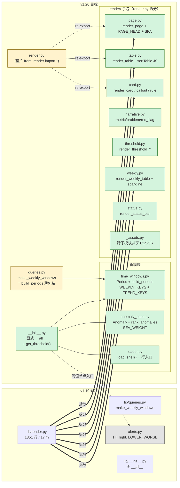

# chexian-report-shell v1.20 — 重构计划（refined）

## Context

`chexian-report-shell` 是车险诊断报告的共享渲染层，被 3 个 `diagnose-*` 业务 skill 与本仓库的 ad-hoc 脚本（`scripts/ad-hoc/young_driver_diagnosis.py:33`、`callout_redesign_demo.py:23`）import 复用。当前 v1.19 稳定但走查暴露 4 个痛点：

1. `lib/render.py` 1851 行（占 lib 体积 ~46%），17 个公开函数 + 大段内联 CSS/JS 模板挤一起，可读性到瓶颈。
2. 下游 3 个 skill 用了 3 种不同的 import 方式（`sys.path.insert` / `importlib` 隔离 / try-except fallback），新 skill 摸不清推荐路径。
3. 业务侧 `diagnose-period-trend` 自己写了 `Period` / `Anomaly` / `derive_metrics()` —— 这些是诊断报告的**通用能力**，应该下沉到 shell。
4. 历史残留：`SKILL.md` 保留 v1.18 废弃章节、`examples/` 与 `styles/` 为空目录、`tests/test_sections_contract.py` 是空文件但 SKILL.md 声称"9 个契约单测全 PASS"。

**目标**：v1.20 把 period-trend 验证过的实践沉淀到 shell，按组件拆开 `render.py`，统一 import 入口，补齐契约测试。**严格向后兼容**——3 个下游 skill + 2 个 ad-hoc 脚本零改动也能继续跑。

## 关键执行环境说明（reviewer 必读）

- **本计划全部改动落在 `~/.claude/skills/chexian-report-shell/`**，是用户本地 `~/.claude/skills/` 目录下的独立 git 仓库（或自管理目录）。
- 本仓库 `chexian-api` 的代码本 PR **零改动**，但有 2 个隐性 consumer 必须在验证步骤中过一遍（详见验证 §6）：
  - `scripts/ad-hoc/young_driver_diagnosis.py:33` — `from lib import standard_query, auto_cutoff, DIM_EXPR, PRICE_BUCKETS, render_table, render_card, render_callout, render_rule, render_page`
  - `scripts/ad-hoc/callout_redesign_demo.py:23` — `from lib import standard_query`
- 阈值数值 `TH_VC/TH_LR/TH_IR/TH_CC/TH_MR/TH_AC_CARGO` 已经在本仓库 `数据管理/pipelines/diagnose_common.py:93-98` 复刻，且 `server/src/config/metric-registry/types.ts:49,72` + `categories/{growth,structure,plan}.ts` 都引用 `lib/alerts.py v1.7` 作为来源说明。**这条红线本 PR 一行不动**（不改 `alerts.TH` 字典字面值、不改 `LOWER_WORSE`、不改 `light()` 签名）。

## 结构变更（mermaid）



依赖顺序：`time_windows`/`anomaly_base`/`loader` 互不依赖，可并行落地；`render/` 子包拆分必须在 `__init__.py` 调整前完成；`queries.py` 薄包装在 `time_windows.py` 之后。

## 工作项（6 项 · 1 PR · 严格兼容）

### 1. 下沉 `Period` → `lib/time_windows.py`（新建，~80 行）

```python
@dataclass(frozen=True)
class Period:
    label: str
    start_excl: date
    end_incl: date

WEEKLY_KEYS: list[tuple[str, str]] = [
    ("last_quarter", "上季度"), ("last_month", "上月"),
    ("week_before_last", "上上周"), ("last_week", "上周"), ("this_week", "当周"),
]
TREND_KEYS: list[tuple[str, str]] = [  # 直接搬 period-trend/lib/periods.py:PERIOD_KEYS
    ("36m", "滚动36个月"), ("24m", "滚动24个月"), ("yoy", "上年同期"),
    ("12m", "滚动12个月"), ("6m", "滚动6个月"), ("ytd", "当年起保"),
]

def build_periods(cutoff: date, *, preset: str = "trend",
                  keys: list[str] | None = None) -> list[Period]: ...
def _shift_months(cutoff: date, months: int) -> date: ...  # 闰年 2/29 安全
```

`lib/queries.py:make_weekly_windows(cutoff)` 改为：

```python
def make_weekly_windows(cutoff):
    """v1.19 兼容入口；新代码请用 build_periods(cutoff, preset='weekly')。"""
    from .time_windows import build_periods
    return [(p.label, p.start_excl, p.end_incl)
            for p in build_periods(cutoff, preset="weekly")]
```

period-trend 后续 PR 自己改为 `from chexian_report_shell.time_windows import Period, build_periods`，**本 PR 不动 period-trend**。

### 2. 下沉 `Anomaly` 基类 → `lib/anomaly_base.py`（新建，~60 行）

抽取 period-trend `lib/anomalies.py` 的**通用骨架**，不抽业务字段（sparkline 时间窗顺序、ranked metrics 名单、7 个 aux dim 都留在业务侧）：

```python
@dataclass(frozen=True)
class Anomaly:
    tag: str
    dim_label: str
    dim_value: str
    metric: str           # 对应 alerts.TH 的 key
    value: float
    alert_class: str      # light() 返回的 CSS 类
    alert_label: str      # 优秀/健康/异常/危险
    severity: int         # SEV_WEIGHT 映射
    premium_share: float
    delta: float
    note: str = ""

SEV_WEIGHT: dict[str, int] = {"red": 4, "yellow": 2, "blue": 0, "green": 0, "gray": 0}

def rank_anomalies(rows: list[Anomaly], n: int = 8,
                   strategy: str = "severity_x_premium") -> list[Anomaly]: ...
```

period-trend 的 `Anomaly` 后续可改为继承本基类扩展业务字段，本 PR 不强制迁移。

### 3. 统一 import 入口 → `lib/loader.py` + 改 `lib/__init__.py`

```python
# lib/loader.py
def load_shell(*, alias: str = "dhr_lib"):
    """一行加载 shell 全量 API：处理 importlib 隔离 + sys.modules 注册。

    用法：
        from chexian_report_shell.loader import load_shell
        shell = load_shell()
        TH, light, render_page = shell.TH, shell.light, shell.render_page
    """
```

`lib/__init__.py` 改造：
- 显式 `__all__`（含 Period / Anomaly / rank_anomalies / build_periods / get_threshold）
- 新增 `get_threshold(metric_key: str, level: str) -> float` 单点入口（底层仍读 `alerts.TH`，**不改字典字面值**，仅锁死外部访问 API）

SKILL.md 新增"推荐 import 方式（v1.20）"表：

| 场景 | 推荐 |
|---|---|
| 新建 diagnose-* skill | `from chexian_report_shell.loader import load_shell` 一行入口 |
| 已存在 skill 维护 | 旧 `sys.path.insert` + `from lib import …` 继续工作，不强制迁移 |
| 本项目 ad-hoc 脚本 | 同上，不强制迁移 |

### 4. 拆分 `render.py`（1851 行 → 7 子模块）

按组件拆，**保持 `from lib import render_page` / `from lib.render import render_page` 100% 可用**：

```
lib/render/
├── __init__.py        # re-export 全部公开函数；同时被 lib/__init__.py 转发
├── _assets.py         # 跨子模块共享的 CSS/JS 字符串模板（PAGE_HEAD/sortTable）
├── page.py            # render_page + 三栏布局 + SPA + drill-toc
├── table.py           # render_table + _info_icon / _dot
├── card.py            # render_card + render_callout + render_rule
├── narrative.py       # render_metric_narrative + render_problem_narrative + render_red_flag
├── threshold.py       # render_threshold_table + render_threshold_card
├── weekly.py          # render_weekly_table + _sparkline_svg
└── status.py          # render_status_bar
```

**兼容垫片**：原 `lib/render.py` 内容替换为：

```python
# v1.20: 实现已迁至 lib/render/；本文件保留为兼容垫片
from .render import *  # noqa: F401,F403
```

**拆分前置动作**：在动手前用 `grep -n "^def \|^[A-Z_]\+ ?=" lib/render.py` 列出所有公开符号（函数 + 模块级常量），按归属表分组；CSS/JS 字符串模板的跨函数引用关系单独梳理一遍，跨子模块共享的统一放 `render/_assets.py`。

### 5. 清理废弃 + 文档重写

**删除**：
- 空目录 `examples/`、`styles/`
- `SKILL.md` v1.18 章节（确认存在再删）
- `lib/render.py` L42 附近"v1.2 已弃用"注释（grep 确认无引用再删）

**SKILL.md 重写**（参考 period-trend SKILL.md 标杆）：
- 新增 §"推荐 import 方式（v1.20）"
- 新增 §"时间窗 API（time_windows.py）"
- 新增 §"异常排名 API（anomaly_base.py）"
- 新增 §"get_threshold API" — 替代散落 `TH[...]`
- 删 v1.18 章节
- 变更日志补 v1.20 条目（列出新增/兼容/删除三组）

**README.md** 同步：3 步集成指南改为推荐 `load_shell()`，保留 `sys.path.insert` 作 fallback 提示。

### 6. 补 `tests/test_sections_contract.py`（~10 用例）

```python
class TestTimeWindows:
    def test_build_periods_trend_preset_returns_6_periods(self): ...
    def test_build_periods_weekly_preset_returns_5_periods(self): ...
    def test_period_keys_subsetting(self): ...        # --periods ytd,yoy 裁剪
    def test_shift_months_leap_year_safe(self): ...   # 2/29 边界

class TestAnomalyBase:
    def test_rank_anomalies_severity_order(self): ...  # red > yellow > blue
    def test_rank_anomalies_topn_truncation(self): ...

class TestRenderFacade:
    def test_legacy_import_from_lib_still_works(self): ...   # from lib import render_page
    def test_new_render_subpackage_imports(self): ...        # from lib.render.page import render_page
    def test_render_package_root_imports(self): ...          # from lib.render import render_page

class TestLoader:
    def test_load_shell_returns_full_api(self): ...    # shell.light / shell.TH / shell.render_page
    def test_load_shell_idempotent(self): ...

class TestThresholdAPI:
    def test_get_threshold_matches_TH_dict(self): ...  # 阈值唯一事实源不漂移
```

约 12 个测试，`pytest ~/.claude/skills/chexian-report-shell/tests/ -v` 全 PASS。

## 关键文件清单

### 新建（在 `~/.claude/skills/chexian-report-shell/`）
- `lib/time_windows.py` — Period + build_periods + WEEKLY_KEYS + TREND_KEYS
- `lib/anomaly_base.py` — Anomaly + SEV_WEIGHT + rank_anomalies
- `lib/loader.py` — load_shell() 一行入口
- `lib/render/__init__.py` + 8 子模块（含 `_assets.py`）
- `tests/test_sections_contract.py`

### 修改
- `lib/__init__.py` — 显式 `__all__` + 新 API 导出 + `get_threshold()`
- `lib/render.py` — 改为兼容垫片
- `lib/queries.py:make_weekly_windows` — 改为 `build_periods` 薄包装
- `SKILL.md` — 删 v1.18 / 加 v1.20 章节 / 重写"如何被业务 skill 集成"
- `README.md` — 同步推荐 `load_shell()`

### 删除
- 空目录 `examples/`、`styles/`
- SKILL.md v1.18 章节

### 不动（红线保护）
- `lib/alerts.py:TH` 字典字面值 + `LOWER_WORSE` + `light()` 签名（被本仓库 `数据管理/pipelines/diagnose_common.py:93-98`、`server/src/config/metric-registry/types.ts:49,72` 引用为来源）
- `lib/dimensions.py` / `lib/drill_body.py` / `lib/page_ids.py`（v1.19 刚改完稳定）
- `lib/push.py` / `lib/report_queries.py`
- 3 个下游 skill（`diagnose-org-weekly` / `diagnose-period-trend` / `diagnose-loss-development`）
- 本仓库 `scripts/ad-hoc/young_driver_diagnosis.py` 与 `scripts/ad-hoc/callout_redesign_demo.py`

## 验证步骤

### 1. Shell 内部自检
```bash
cd ~/.claude/skills/chexian-report-shell
pytest tests/ -v                                       # 全 PASS
python3 -c "from lib import render_page, light, TH, Period, Anomaly, load_shell, get_threshold; print('OK')"
python3 -c "from lib.render.page import render_page; print('OK')"   # 新路径
python3 -c "from lib.render import render_page; print('OK')"         # 子包根
python3 -c "from lib import render_page; print('OK')"                # 旧路径兼容
```

### 2. 阈值红线核查（关键证据）
```bash
# 确认 TH 字典字面值与本 PR 前完全一致
cd ~/.claude/skills/chexian-report-shell
git diff main -- lib/alerts.py        # 期望：空 diff（或仅注释 / version 字段）
# 跨仓库对齐核对
diff <(python3 -c "from lib.alerts import TH; print(sorted(TH.items()))") \
     <(python3 -c "import sys; sys.path.insert(0, '/path/to/chexian-api/数据管理/pipelines'); \
                   from diagnose_common import TH_VC, TH_LR, TH_IR, TH_CC, TH_MR, TH_AC_CARGO; \
                   print(sorted({'VC':TH_VC,'LR':TH_LR,'IR':TH_IR,'CC':TH_CC,'MR':TH_MR,'AC_CARGO':TH_AC_CARGO}.items()))")
```

### 3. 3 个下游业务 skill 端到端冒烟
```bash
python3 ~/.claude/skills/diagnose-period-trend/lib/cli.py --view all
python3 ~/.claude/skills/diagnose-org-weekly/cli.py --org "天府" --year 2026
python3 ~/.claude/skills/diagnose-loss-development/lib/cli.py
```

### 4. 本仓库 ad-hoc 脚本冒烟（容易被忽略的 consumer）
```bash
cd /Users/<user>/Desktop/chexian-api   # 或本机 chexian-api 路径
python3 scripts/ad-hoc/callout_redesign_demo.py      # 验证 from lib import standard_query 仍可用
python3 scripts/ad-hoc/young_driver_diagnosis.py     # 验证 9 个 from lib import 符号全部健在
```

### 5. 产物字节级 diff（兼容性证据）
```bash
# v1.19 基线先存档
git -C ~/.claude/skills/chexian-report-shell worktree add /tmp/shell-v119 v1.19-tag
# v1.20 跑同一组三个下游 skill，HTML 输出 diff
diff -r <(python3 ~/.claude/skills/diagnose-period-trend/lib/cli.py --view all && cat /tmp/output) \
        <(...)
# 期望：HTML 内容完全一致（仅时间戳 / page_id md5 可能差）
```

### 6. SKILL.md 引用一致性
```bash
grep -rn "v1.18" ~/.claude/skills/chexian-report-shell/  # 应只剩变更日志历史引用
grep -rn "lib/drill_writer" ~/.claude/skills/chexian-report-shell/  # v1.19 已删，应 0 匹配
grep -rn "from lib import" ~/.claude/skills/diagnose-*/  # 旧入口应继续被业务 skill 使用
```

## 风险与缓解

| 风险 | 缓解 |
|---|---|
| `render.py` 拆分后跨文件共用的 CSS/JS 字符串导致渲染坏 | 拆分前先列依赖图；跨子模块共用字符串统一放 `render/_assets.py`；产物字节级 diff 兜底 |
| period-trend 自己的 `Anomaly` 类与下沉的基类字段冲突 | shell 只下沉骨架，period-trend 后续 PR 再继承迁移，本 PR 不强制 |
| 业务 skill 仍用 `make_weekly_windows()` | 保留薄包装，不删，不加 DeprecationWarning（v1.20 是无感知升级） |
| 本仓库 ad-hoc 脚本被遗忘 | 验证 §4 单列；2 个脚本都跑过 |
| importlib loader 在某些 Python 版本异常 | 测试覆盖 3.10/3.11/3.12；fallback 保留 `sys.path` 方式 |
| `alerts.TH` 在重构中被意外改动 | 验证 §2 `git diff -- lib/alerts.py` 强制空 diff；CI 加 `assert_threshold_in_sync` |

## 不在本次范围

- ❌ 不动 `alerts.TH` 字典字面值（被本仓库 3 处引用为唯一事实源）
- ❌ 不动 3 个下游 skill 或本仓库 2 个 ad-hoc 脚本
- ❌ 不抽业务侧 view variants（V1/V3/V4 — 每个 skill 视图差异大，过早抽象）
- ❌ 不抽 `report_queries.py` 的 chexian-api 专用 fetch 函数
- ❌ 不改 `dimensions.py` / `drill_body.py` / `page_ids.py`（v1.19 刚改完稳定）

## 可选：单 PR vs 拆 3 个

draft 估时 ~11h 单 PR。如想缩小爆炸半径，可拆为：
- PR-A：工作项 1+2+3（下沉 + loader，纯新增，~4h）
- PR-B：工作项 4（render.py 拆分，~3h，独立产物 diff 验证）
- PR-C：工作项 5+6（清理 + 测试，~3h）

实施者自行决定；本计划默认单 PR。
